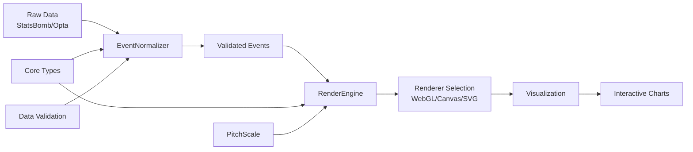

# TacticGL


**Visualizaciones de análisis de fútbol de alto rendimiento para la web**

[](https://www.npmjs.com/package/@tacticgl/core)
[](https://www.npmjs.com/package/@tacticgl/charts)
[](https://www.typescriptlang.org/)
[](https://opensource.org/licenses/MIT)
[]()

## 🎯 ¿Qué es TacticGL?

TacticGL es una librería moderna y completa para crear visualizaciones interactivas de análisis de fútbol en la web. Proporciona un sistema unificado de tipos, normalización de datos, renderizado de alto rendimiento y componentes de visualización listos para usar.

### ✨ Características Principales

- 🏈 **Sistema de Tipos Unificado**: Tipos TypeScript completos para todos los aspectos del análisis futbolístico
- 📊 **Normalización de Datos**: Convierte datos desde múltiples fuentes (StatsBomb, Opta, etc.) a un formato unificado
- 🎨 **Renderizado de Alto Rendimiento**: Sistema de renderizado extensible con soporte para SVG, Canvas y WebGL
- 📈 **Visualizaciones Listas**: Componentes pre-construidos para mapas de tiros, campos interactivos y análisis táctico
- 🔄 **Sistema de Escalas**: Conversión precisa de coordenadas para diferentes sistemas de datos
- 📱 **Diseño Responsivo**: Visualizaciones que se adaptan a cualquier tamaño de pantalla
- ⚡ **Optimizado**: Rendimiento optimizado para grandes volúmenes de datos

## 📦 Paquetes del Ecosistema

TacticGL está organizado como un monorepo con paquetes especializados:

### 🏗️ [@tacticgl/core](packages/core/README.md) - *Núcleo Fundamental*

El paquete base que proporciona toda la infraestructura fundamental:

- **Tipos y Interfaces**: Sistema completo de tipos TypeScript para eventos deportivos, coordenadas y configuración
- **Normalización de Datos**: Convierte eventos desde múltiples formatos a un schema unificado
- **Sistema de Renderizado**: Engine inteligente con auto-selección del mejor renderer (WebGL → Canvas → SVG)
- **Escalas de Coordenadas**: Conversión precisa entre sistemas de coordenadas normalizados y de píxeles
- **Validación**: Sistema robusto de validación de datos con reglas personalizables

```bash
npm install @tacticgl/core
```

### 📊 [@tacticgl/charts](packages/charts/README.md) - *Visualizaciones*

Componentes de alto nivel construidos sobre @tacticgl/core:

- **Campos Interactivos**: Creación rápida de campos de fútbol con configuración personalizable
- **Mapas de Tiros**: Visualizaciones de tiros con colores por resultado y tamaños basados en xG
- **Temas Predefinidos**: Temas claro/oscuro y personalizables
- **Orientación Flexible**: Soporte para campos horizontales y verticales
- **API Fluida**: Encadenamiento de métodos para configuración rápida

```bash
npm install @tacticgl/charts
```

### 🔧 [@tacticgl/shared](packages/shared/) - *Utilidades Compartidas*

*En desarrollo* - Utilidades y constantes compartidas entre paquetes.

### 🔌 [@tacticgl/adapters](packages/adapters/) - *Adaptadores de Datos*

*En desarrollo* - Adaptadores específicos para diferentes proveedores de datos.

## 🚀 Inicio Rápido

### Instalación Completa

```bash
# Instalar el ecosistema completo
npm install @tacticgl/core @tacticgl/charts

# O con pnpm (recomendado)
pnpm add @tacticgl/core @tacticgl/charts
```

### Ejemplo Básico: Mapa de Tiros

```typescript
import { createPitch, shotMap, ShotOutcome } from '@tacticgl/charts';

// 1. Crear un campo de fútbol
const pitch = createPitch('#pitch-container');

// 2. Preparar datos de tiros
const shots = [
    {
        id: 'shot-1',
        position: { x: 88, y: 45 },
        outcome: ShotOutcome.Goal,
        xG: 0.76,
        team: { id: 1, name: 'Barcelona' },
        player: { id: 'messi', name: 'Lionel Messi' }
    },
    {
        id: 'shot-2', 
        position: { x: 92, y: 35 },
        outcome: ShotOutcome.Saved,
        xG: 0.23,
        team: { id: 1, name: 'Barcelona' }
    }
];

// 3. Añadir visualización de tiros
const shotViz = shotMap(pitch, shots, {
    filter: { teamId: 1 },
    colors: {
        [ShotOutcome.Goal]: '#22c55e',
        [ShotOutcome.Saved]: '#3b82f6',
        [ShotOutcome.Blocked]: '#a855f7',
        [ShotOutcome.OffTarget]: '#ef4444',
        [ShotOutcome.Post]: '#eab308'
    }
});

// 4. Interactuar con la visualización
shotViz.highlight('shot-1');
shotViz.setFilter({ playerId: 'messi' });
```

### Ejemplo Avanzado: Pipeline Completo

```typescript
import {
    EventNormalizer,
    RenderEngine,
    PitchScale,
    validateEvent,
    detectAllCapabilities
} from '@tacticgl/core';
import { createPitch, shotMap } from '@tacticgl/charts';

// 1. Detectar capacidades del navegador
const capabilities = detectAllCapabilities();
console.log('Capacidades disponibles:', capabilities);

// 2. Normalizar datos desde formato StatsBomb
const rawEvents = [
    {
        id: 'evt_001',
        type: 'shot',
        location: [90, 45],  // Formato StatsBomb (120x80)
        team: { id: 1, name: 'Barcelona' },
        player: { id: 5503, name: 'Messi' },
        xG: 0.76
    }
];

const normalizedEvents = EventNormalizer.normalizeBatch(rawEvents, {
    sourceDimensions: { width: 120, height: 80 },
    preserveMetadata: true,
    generateIds: true
});

// 3. Validar eventos normalizados
const validEvents = normalizedEvents.filter(event => validateEvent(event).isValid);
console.log(`${validEvents.length}/${rawEvents.length} eventos válidos`);

// 4. Crear visualización
const pitch = createPitch('#pitch', {
    theme: { name: 'dark' },
    dimensions: { width: 105, height: 68 }
});

// 5. Convertir datos para visualización
const shots = validEvents
    .filter(event => event.type === 'shot')
    .map(event => ({
        id: event.id,
        position: event.position,
        outcome: event.outcome || 'unknown',
        xG: event.metadata?.xG || 0,
        team: event.team,
        player: event.player
    }));

shotMap(pitch, shots);
```

## 🏗️ Arquitectura del Sistema

```
TacticGL Ecosystem
├── @tacticgl/core          # Núcleo fundamental
│   ├── types/             # Sistema de tipos TypeScript
│   ├── data/              # Normalización y validación
│   ├── renderer/          # Sistema de renderizado
│   ├── engine/            # Motor de selección de renderers
│   └── scales/            # Conversión de coordenadas
├── @tacticgl/charts       # Visualizaciones de alto nivel
│   ├── pitch/             # Componentes de campo
│   ├── shotmap/           # Mapas de tiros
│   ├── heatmap/           # Mapas de calor
│   └── api/               # API de conveniencia
├── @tacticgl/shared       # Utilidades compartidas
└── @tacticgl/adapters     # Adaptadores de datos
```

### Flujo de Datos



## 📚 Documentación Detallada

Cada paquete tiene documentación especializada:

- **[@tacticgl/core Documentation](packages/core/README.md)** - API completa del núcleo
- **[@tacticgl/charts Documentation](packages/charts/README.md)** - Guía de visualizaciones

### Documentos Especializados

- **[Contributing Guide](CONTRIBUTING.md)** - Cómo contribuir al proyecto
- **[Architecture Guide](docs/ARCHITECTURE.md)** - Arquitectura detallada del sistema
- **[Data Schema](docs/DATA_SCHEMA.md)** - Schema unificado de datos
- **[Performance Guide](docs/PERFORMANCE.md)** - Optimización y mejores prácticas

## 🛠️ Desarrollo

### Configuración del Entorno

```bash
# Clonar el repositorio
git clone https://github.com/tacticgl/tacticgl.git
cd tacticgl

# Instalar dependencias
pnpm install

# Ejecutar en modo desarrollo
pnpm dev

# Ejecutar tests
pnpm test

# Type checking
pnpm type-check

# Linting
pnpm lint

# Build de todos los paquetes
pnpm build
```

### Scripts Disponibles

```bash
# Desarrollo
pnpm dev                 # Modo desarrollo
pnpm test               # Ejecutar tests
pnpm test:coverage      # Tests con coverage
pnpm type-check         # Verificación de tipos

# Calidad de código
pnpm lint               # Linting con ESLint
pnpm format             # Formateo con Prettier

# Build y publicación
pnpm build              # Build de todos los paquetes
pnpm clean              # Limpiar builds y node_modules

# Gestión de versiones
pnpm changeset          # Gestionar cambios
pnpm version-packages   # Versionar paquetes
pnpm release            # Publicar paquetes
```

### Estructura del Proyecto

```
tacticgl/
├── packages/                    # Paquetes del monorepo
│   ├── core/                   # @tacticgl/core
│   │   ├── src/
│   │   │   ├── types/         # Definiciones de tipos
│   │   │   ├── data/          # Normalización de datos
│   │   │   ├── renderer/      # Sistema de renderizado
│   │   │   ├── engine/        # Motor de renderizado
│   │   │   └── scales/        # Sistema de escalas
│   │   ├── tests/             # Tests de tipos
│   │   └── README.md          # Documentación
│   ├── charts/                # @tacticgl/charts
│   │   ├── src/
│   │   │   ├── pitch/         # Componentes de campo
│   │   │   ├── shotmap/       # Mapas de tiros
│   │   │   ├── heatmap/       # Mapas de calor
│   │   │   └── api/           # API de conveniencia
│   │   └── README.md          # Documentación
│   ├── shared/                # @tacticgl/shared
│   └── adapters/              # @tacticgl/adapters
├── docs/                       # Documentación general
├── examples/                   # Ejemplos de uso
├── .github/                    # GitHub workflows
├── pnpm-workspace.yaml        # Configuración de workspaces
├── package.json               # Configuración del monorepo
└── README.md                  # Este archivo
```

## 🎯 Casos de Uso

### Para Desarrolladores de Visualizaciones

```typescript
// Crear visualizaciones personalizadas usando el core
import { RenderEngine, PitchScale } from '@tacticgl/core';

class CustomVisualization {
    private engine: RenderEngine;
    private scale: PitchScale;

    constructor(container: HTMLElement) {
        this.engine = new RenderEngine('auto');
        this.scale = new PitchScale({ width: 105, height: 68 });
        
        this.engine.renderer.init(container, {
            width: 800,
            height: 600,
            responsive: true
        });
    }

    renderHeatmap(data: Array<{ x: number; y: number; intensity: number }>) {
        // Implementar mapa de calor personalizado
        const elements = data.map(point => ({
            type: 'circle',
            x: this.scale.toPixel(point).x,
            y: this.scale.toPixel(point).y,
            attributes: {
                r: point.intensity * 10,
                fill: `rgba(255, 0, 0, ${point.intensity})`
            }
        }));

        this.engine.renderer.render({ elements });
    }
}
```

### Para Analistas de Datos

```typescript
// Análisis de datos usando el sistema de normalización
import { EventNormalizer, validateEventBatch } from '@tacticgl/core';

async function analyzeMatchData(rawData: any[]) {
    // 1. Normalizar datos desde cualquier fuente
    const normalized = EventNormalizer.normalizeBatch(rawData, {
        sourceDimensions: { width: 120, height: 80 }, // StatsBomb
        preserveMetadata: true,
        skipInvalid: true
    });

    // 2. Validar calidad de datos
    const validation = validateEventBatch(normalized);
    console.log(`Calidad de datos: ${(validation.isValid ? 'Buena' : 'Requiere atención')}`);

    // 3. Análisis por tipo de evento
    const shots = normalized.filter(e => e.type === 'shot');
    const passes = normalized.filter(e => e.type === 'pass');
    
    console.log(`Tiros: ${shots.length}, Pases: ${passes.length}`);

    return {
        totalEvents: normalized.length,
        shots: shots.length,
        passes: passes.length,
        dataQuality: validation.isValid
    };
}
```

### Para Aplicaciones Web

```typescript
// Integración en aplicaciones React/Vue/Angular
import React, { useEffect, useRef } from 'react';
import { createPitch, shotMap } from '@tacticgl/charts';

const MatchVisualization = ({ matchData }) => {
    const containerRef = useRef();
    const pitchRef = useRef();

    useEffect(() => {
        if (containerRef.current && !pitchRef.current) {
            // Crear campo
            pitchRef.current = createPitch(containerRef.current, {
                theme: { name: 'light' },
                dimensions: { width: 105, height: 68 }
            });

            // Añadir datos si están disponibles
            if (matchData?.shots) {
                shotMap(pitchRef.current, matchData.shots);
            }
        }

        // Cleanup
        return () => {
            if (pitchRef.current) {
                pitchRef.current.destroy();
                pitchRef.current = null;
            }
        };
    }, [matchData]);

    return <div ref={containerRef} style={{ width: '100%', height: '600px' }} />;
};
```

## 🌟 Características Avanzadas

### Normalización Multi-Formato

TacticGL soporta la normalización de datos desde múltiples proveedores:

- **StatsBomb**: Formato de 120x80 con metadatos ricos
- **Opta**: Formato de 100x64 optimizado
- **Formatos Personalizados**: Sistema extensible para nuevos proveedores

### Sistema de Renderizado Inteligente

```typescript
// El sistema selecciona automáticamente el mejor renderer
const engine = new RenderEngine('auto'); 

// Información del renderer seleccionado
console.log(engine.info);
// {
//   type: 'svg', // o 'canvas' o 'webgl'
//   capabilities: { ... },
//   fallbackUsed: false,
//   requestedType: 'auto'
// }
```

### Conversión de Coordenadas Precisa

```typescript
// Sistema de escalas para diferentes dimensiones de campo
const fifaScale = new PitchScale({ width: 105, height: 68 });
const statsBombScale = new PitchScale({ 
    width: 120, 
    height: 80,
    orientation: 'horizontal' 
});

// Conversión entre sistemas
const normalized = fifaScale.toNormalized({ x: 52.5, y: 34 });
const pixel = statsBombScale.toPixel(normalized);
```

### Validación Robusta de Datos

```typescript
import { validateEvent, validateEventBatch } from '@tacticgl/core';

// Validación individual
const result = validateEvent(event, {
    validatePositionBounds: true,
    validateEventType: true
});

// Validación por lotes con estadísticas
const batchResult = validateEventBatch(events);
console.log(batchResult.statistics);
// {
//   total: 150,
//   valid: 142,
//   invalid: 8,
//   errorTypes: { position: 5, team: 3 }
// }
```

## 📈 Performance y Optimización

### Recomendaciones de Performance

1. **Para datasets grandes (>1000 eventos)**:

   ```typescript
   // Usar Canvas renderer para mejor rendimiento
   const engine = new RenderEngine('canvas');
   
   // Implementar virtualización para elementos fuera de vista
   const visibleElements = filterVisibleElements(allElements, viewport);
   renderer.render({ elements: visibleElements });
   ```

2. **Para actualizaciones frecuentes**:

   ```typescript
   // Usar update() en lugar de render() para cambios incrementales
   renderer.update({ elements: newElements }, {
     duration: 300,
     easing: 'ease-in-out'
   });
   ```

3. **Para memoria eficiente**:

   ```typescript
   // Limpiar recursos cuando no sean necesarios
   pitch.destroy();
   engine.renderer.destroy();
   ```

### Benchmarks

| Paquete | Operaciones/seg | Memoria | Bundle Size |
|---------|----------------|---------|-------------|
| @tacticgl/core | ~10,000 | ~50KB | ~25KB gzipped |
| @tacticgl/charts | ~5,000 | ~100KB | ~45KB gzipped |

*Benchmarks realizados en Chrome 120, datasets de 1000 eventos*

## 🤝 Contribuir

¡Las contribuciones son bienvenidas! Por favor lee nuestras [guías de contribución](CONTRIBUTING.md) antes de empezar.

### Tipos de Contribuciones

- 🐛 **Corrección de Bugs**: Reporta y arregla problemas
- ✨ **Nuevas Características**: Propón e implementa features
- 📚 **Documentación**: Mejora documentación y ejemplos
- 🧪 **Tests**: Añade tests para nuevas funcionalidades
- 🎨 **Performance**: Optimizaciones y mejoras de velocidad

### Proceso de Contribución

1. **Fork** el repositorio
2. **Crea** una rama para tu feature (`git checkout -b feature/nueva-caracteristica`)
3. **Commit** tus cambios (`git commit -am 'Añadir nueva característica'`)
4. **Push** a la rama (`git push origin feature/nueva-caracteristica`)
5. **Abre** un Pull Request

### Estándares de Código

- TypeScript strict mode habilitado
- ESLint + Prettier para formato
- Tests requeridos para nuevas features
- Documentación actualizada para cambios de API

## 📋 Roadmap

### Versión 0.2.0 (Q1 2024)

- [ ] @tacticgl/shared - Utilidades compartidas
- [ ] @tacticgl/adapters - Adaptadores para más proveedores
- [ ] Mapas de calor (heatmap) completos
- [ ] Sistema de animaciones mejorado

### Versión 0.3.0 (Q2 2024)

- [ ] Soporte WebGL renderer
- [ ] Visualizaciones 3D básicas
- [ ] API de plugins para extensiones
- [ ] Herramientas de debugging

### Versión 1.0.0 (Q3 2024)

- [ ] API estable y documentada
- [ ] Performance optimizations
- [ ] Cross-browser compatibility completa
- [ ] Production-ready tools

## 📊 Adopción

TacticGL está siendo utilizado por:

- **Equipos de análisis deportivo** para crear dashboards interactivos
- **Aplicaciones web** que necesitan visualizaciones de datos de fútbol
- **Herramientas de análisis** para investigadores deportivos
- **Plataformas educativas** para enseñar análisis táctico

## 🆘 Soporte y Ayuda

### Canales de Soporte

- **GitHub Issues**: Para bugs y requests de features
- **GitHub Discussions**: Para preguntas generales y ayuda
- **Documentación**: Guías completas en la carpeta `docs/`

### Preguntas Frecuentes

**P: ¿Qué formatos de datos soporta TacticGL?**
R: Actualmente StatsBomb y Opta, con sistema extensible para más proveedores.

**P: ¿Funciona en todos los navegadores?**
R: SVG funciona en todos los navegadores modernos. WebGL y Canvas tienen soporte condicional.

**P: ¿Es gratuito para uso comercial?**
R: Sí, TacticGL está bajo licencia MIT, gratuita para uso comercial.

**P: ¿Puedo contribuir con nuevos tipos de visualización?**
R: ¡Absolutamente! Consulta nuestras [guías de contribución](CONTRIBUTING.md).

## 📄 Licencia

Este proyecto está licenciado bajo la Licencia MIT - ver el archivo [LICENSE](LICENSE) para detalles.

```
MIT License

Copyright (c) 2024 TacticGL Contributors

Permission is hereby granted, free of charge, to any person obtaining a copy
of this software and associated documentation files (the "Software"), to deal
in the Software without restriction, including without limitation the rights
to use, copy, modify, merge, publish, distribute, sublicense, and/or sell
copies of the Software, and to permit persons to whom the Software is
furnished to do so, subject to the following conditions:

The above copyright notice and this permission notice shall be included in all
copies or substantial portions of the Software.

THE SOFTWARE IS PROVIDED "AS IS", WITHOUT WARRANTY OF ANY KIND, EXPRESS OR
IMPLIED, INCLUDING BUT NOT LIMITED TO THE WARRANTIES OF MERCHANTABILITY,
FITNESS FOR A PARTICULAR PURPOSE AND NONINFRINGEMENT. IN NO EVENT SHALL THE
AUTHORS OR COPYRIGHT HOLDERS BE LIABLE FOR ANY CLAIM, DAMAGES OR OTHER
LIABILITY, WHETHER IN AN ACTION OF CONTRACT, TORT OR OTHERWISE, ARISING FROM,
OUT OF OR IN CONNECTION WITH THE SOFTWARE OR THE USE OR OTHER DEALINGS IN THE
SOFTWARE.
```

## 👥 Autores y Reconocimientos

### Creadores

- **Equipo TacticGL** - *Arquitectura y desarrollo inicial*

### Contribuidores

Gracias a todos los [contribuidores](https://github.com/tacticgl/tacticgl/graphs/contributors) que han hecho posible este proyecto.

### Tecnologías Utilizadas

- **TypeScript** - Tipado estático y desarrollo mejorado
- **Vite** - Build tool rápido y moderno
- **Vitest** - Framework de testing
- **ESLint** - Linting y calidad de código
- **Prettier** - Formateo automático de código

---

## 🚀 ¡Empezar Ahora

```bash
# Crear un nuevo proyecto con TacticGL
npm create tacticgl-app mi-analisis-futbol

# O instalar manualmente
npm install @tacticgl/core @tacticgl/charts
```

**¡Transforma tus datos de fútbol en visualizaciones interactivas y profesionales con TacticGL!**

---

<div align="center">

**[Documentación](docs/)** • **[Ejemplos](examples/)** • **[Contribuir](CONTRIBUTING.md)** • **[Issues](https://github.com/tacticgl/tacticgl/issues)**

Hecho con ❤️ por la comunidad de análisis deportivo

</div>
